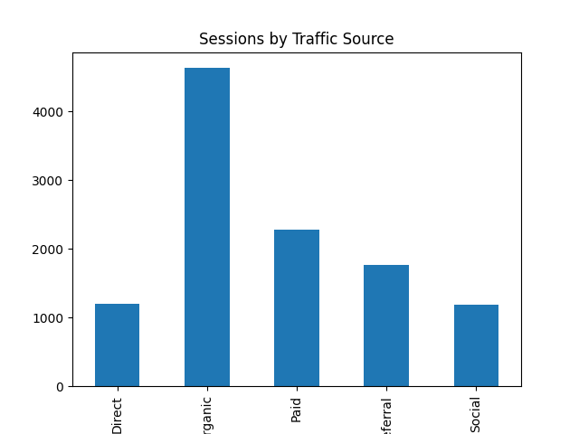
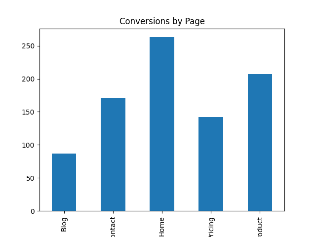
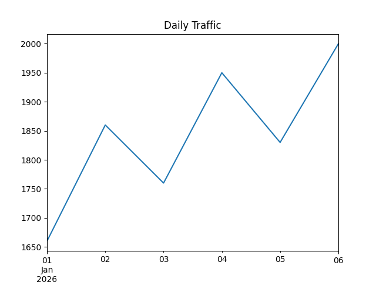

# 📊 Website Traffic Analysis

## 🔍 Problem Statement
Understanding website traffic and user behavior is crucial for improving engagement and increasing conversions. This project analyzes website data to identify patterns and optimize performance.

---

## 🎯 Objective
- Analyze traffic sources
- Understand user engagement
- Identify high-performing pages
- Improve conversion strategy

---

## 🛠 Tools Used
- Python (Pandas, Matplotlib)
- Jupyter Notebook

---

## 📊 Key Insights
- Organic traffic drives the highest number of users.
- Product and Pricing pages generate the most conversions.
- Blog page has a high bounce rate.
- Contact page shows strong engagement.
- Paid traffic needs optimization.

---

## 💡 Business Recommendations
- Improve SEO strategy to increase organic traffic further.
- Optimize Blog content to reduce bounce rate.
- Focus marketing efforts on Product & Pricing pages.
- Improve targeting in paid ads to reduce bounce rate.
- Enhance user experience to increase session duration.

---

## 📸 Visualizations

### Traffic Source

### Page Conversion

### Daily Trend

---

## 📁 Files
- website_traffic_analysis.ipynb
- website_traffic.csv
- PNG visualizations

---

## 🚀 Conclusion
This project helps businesses make data-driven decisions to improve website performance, user engagement, and conversion rates.
